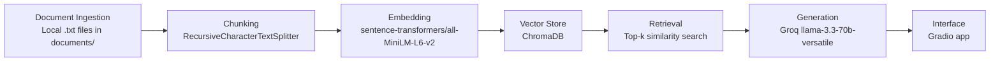

# DMV Weekend Guide

> A student-focused weekend activity assistant for the DC, Virginia, and Maryland area.

DMV Weekend Guide is a retrieval-augmented generation system that helps students find weekend activities in the DMV area. It answers natural language questions by retrieving relevant passages from local activity documents and generating answers grounded in those retrieved sources.

This project started from the RulesBot starter repo, but I adapted the domain from board game rules to **student weekend activity planning in DC, Northern Virginia, and Maryland**.

---

## Project Overview

Students often want quick answers to practical weekend questions:

- Is Burke Lake good for beginner boating?
- Is Great Falls too crowded on weekends?
- What indoor activities are good during a heat wave?
- Where can I rent kayaks or paddleboards in Fairfax County?
- What are good free or low-cost things to do in DC this weekend?

The problem is that this information is scattered across many sources: official park pages, tourism sites, event calendars, local blogs, Reddit threads, and review-style pages. This project brings those documents into one searchable RAG pipeline.

The system does not try to answer from general internet knowledge. It retrieves chunks from my collected documents and asks the LLM to answer only from those chunks.

---

## Domain

My domain is:

**Weekend activity recommendations for students in the DC, Virginia, and Maryland area.**

The guide focuses on practical student concerns such as:

- price or budget
- travel distance
- crowds
- weather
- beginner-friendliness
- whether an activity is good for two people or groups
- source-backed recommendations

This domain is useful because a student planning a weekend usually does not just need a list of attractions. They need to know whether an activity is actually practical: how crowded it is, whether it is indoors, whether rentals are available, and whether the source supports the recommendation.

---

## Data Sources

I used local `.txt` files in the `documents/` folder. Each file starts with metadata lines like:

```txt
Title: Fairfax County Burke Lake Boating
URL: https://www.fairfaxcounty.gov/parks/burke-lake/boating
Category: boating
Region: Northern Virginia
```

Then the file contains copied text from the source page.

Example source documents include:

| # | Source | Purpose |
|---|--------|---------|
| 1 | Destination DC: Things to Do This Weekend | Current DC weekend events, festivals, exhibits, and performances |
| 2 | Destination DC: DC Events Calendar | Broader DC event calendar |
| 3 | DowntownDC Events Calendar | Downtown DC public events and free activities |
| 4 | DC250 Events | Special DC celebrations, exhibits, and public events |
| 5 | Fairfax County Rainy Day Activities | Indoor activities for rainy days or heat waves |
| 6 | Fun in Fairfax Indoor Activities | Local indoor activity guide for Northern Virginia |
| 7 | Fairfax County Burke Lake Boating | Official boating and rental information |
| 8 | Fairfax County Burke Lake Marina | Marina rules and lake information |
| 9 | Fun in Fairfax Burke Lake Boating | Local review-style Burke Lake boating information |
| 10 | National Park Service Great Falls Information | Official park information, hours, parking, and safety |
| 11 | Reddit Great Falls crowd discussion | Community opinions about weekend crowds |
| 12 | FXVA Canoe, Kayak, and Paddleboard Rentals | Water rental options in Fairfax County |

---

## Architecture



The system has five main RAG stages:

1. **Document Ingestion:** loads `.txt` files from the `documents/` folder and extracts metadata.
2. **Chunking:** cleans and splits each document into chunks.
3. **Embedding + Vector Store:** embeds chunks using `all-MiniLM-L6-v2` and stores them in ChromaDB.
4. **Retrieval:** retrieves the top matching chunks for a user question.
5. **Generation:** sends retrieved chunks to the LLM and generates a grounded answer with sources.

The interface is built with Gradio.

---

## Project Structure

```txt
ai201-lab1-rulesbot-starter/
├── app.py                       # Gradio interface
├── query.py                     # End-to-end retrieval + generation logic
├── planning.md                  # Design decisions and milestone notes
├── requirements.txt             # Python dependencies
├── .env                         # Groq API key, not committed
├── documents/                   # Local source documents
│   ├── burke_lake_boating.txt
│   ├── great_falls_nps.txt
│   ├── fxva_rainy_day.txt
│   └── ...
├── data/
│   ├── raw_docs.json            # Raw loaded documents
│   ├── cleaned_docs.json        # Cleaned document text
│   ├── chunks.json              # Final chunks for embedding
│   └── chroma_db/               # Local ChromaDB vector store
└── scripts/
    ├── build_chunks.py          # Ingestion, cleaning, and chunking
    └── build_vector_store.py    # Embedding and retrieval testing
```

---

## Getting Started

### 1. Create a virtual environment

```bash
python -m venv .venv
```

Activate it.

On Mac/Linux:

```bash
source .venv/bin/activate
```

On Windows PowerShell:

```powershell
.venv\Scripts\activate
```

### 2. Install dependencies

```bash
pip install -r requirements.txt
```

If packages are missing, install:

```bash
pip install sentence-transformers chromadb groq python-dotenv gradio langchain-text-splitters
```

### 3. Add your Groq API key

Create a `.env` file in the project root:

```txt
GROQ_API_KEY=your_actual_groq_api_key_here
```

Do not commit `.env`.

---

## Running the Pipeline

Run these commands from the project root.

### 1. Build chunks

```bash
python scripts/build_chunks.py
```

This loads documents, cleans text, creates chunks, and saves:

- `data/raw_docs.json`
- `data/cleaned_docs.json`
- `data/chunks.json`

### 2. Build the vector store

```bash
python scripts/build_vector_store.py
```

This embeds all chunks with `sentence-transformers/all-MiniLM-L6-v2` and stores them in ChromaDB.

### 3. Test the backend

```bash
python query.py
```

This lets me ask questions in the terminal before using the web app.

### 4. Run the Gradio app

```bash
python app.py
```

Open:

```txt
http://127.0.0.1:7860
```

---

## Chunking Strategy

I used a chunk size of about **650 characters** with **125 characters of overlap**.

This strategy fits my source documents because they are mostly event listings, park descriptions, local guide entries, and review-style text. A 650-character chunk is usually large enough to contain one complete activity, rule, or recommendation, but not so large that multiple unrelated activities get mixed together.

The overlap helps preserve context when related details appear in adjacent sentences, such as a sentence about Burke Lake rentals followed by a sentence about rules or weekend crowds.

---

## Retrieval Approach

The system embeds each chunk with:

```txt
sentence-transformers/all-MiniLM-L6-v2
```

The chunks are stored in a local ChromaDB collection:

```txt
dmv_weekend_guide
```

For each query, the system retrieves the top 5 most relevant chunks. Each retrieved chunk includes source metadata:

- source title
- filename
- URL
- category
- region
- chunk index
- distance score

This metadata is used for source attribution in the generated answer.

---

## Generation Approach

The system uses Groq with:

```txt
llama-3.3-70b-versatile
```

The prompt tells the model:

- Answer only using the retrieved context.
- Do not use outside knowledge.
- If the documents do not contain enough information, say that.
- Cite sources by source number.
- Keep answers practical and student-focused.
- Organize comparisons clearly.

I also append retrieved source names programmatically so the user can see where the answer came from.

---

## Evaluation Results

I tested the system using the 5 evaluation questions from `planning.md`. For each question, I compared the system response against the expected answer and checked whether the answer was grounded in the retrieved sources.

Fill in the “Actual System Response” and “Accuracy Judgment” columns after running the app.

| # | Question | Expected Answer | Actual System Response | Accuracy Judgment |
|---|----------|-----------------|------------------------|------------------|
| 1 | Is Burke Lake Park good for beginner boating or kayaking? | The answer should mention that Burke Lake has boating/rental information and is reasonable for beginner recreation if the source supports it. It should also mention checking rental rules and that weekends may be busier if the documents include that detail. | ___ | ___ |
| 2 | What indoor activities are good near Northern Virginia during a heat wave? | The answer should recommend indoor Northern Virginia activities from the Fairfax County rainy-day guide or Fun in Fairfax indoor activity guide, such as museums, shopping centers, entertainment venues, cafes, or indoor attractions. | ___ | ___ |
| 3 | Is Great Falls Park crowded on weekends? | The answer should mention weekend crowd or parking concerns using the Great Falls source and/or community crowd discussion. | ___ | ___ |
| 4 | What are good free things to do in DC this weekend? | The answer should use DC weekend/event sources and identify free or low-cost current DC activities if those documents contain the information. If the documents do not include enough current event details or prices, the system should say it does not have enough information. | ___ | ___ |
| 5 | Where can I rent kayaks or paddleboards in Fairfax County? | The answer should cite the FXVA canoe/kayak/paddleboard rental source or Burke Lake boating source and mention rental locations or available rental types if present in the documents. | ___ | ___ |

---

## Failure Case Analysis

One likely failure case was:

**"What are good free things to do in DC this weekend?"**

This question is difficult because it requires current event information and specific price details. My document collection may include DC event calendar sources, but my local `.txt` files may not contain enough up-to-date listings or explicit free/paid labels. Because the system answers only from retrieved chunks, it may return general DC event information instead of a specific list of free activities.

This failure is tied to the **document ingestion and source coverage stages**. The LLM cannot generate a grounded answer if the relevant information was never included in the source documents or if the chunks do not contain price details. To improve this, I would add more current DC event listings with explicit price information or update the ingestion process to refresh event documents more regularly.

Another possible failure case is:

**"For a two-day weekend trip, should I choose Shenandoah or Harpers Ferry?"**

This can fail if my document set does not include strong documents about both Shenandoah and Harpers Ferry. The system can only compare two places well if both places are represented in the vector store.

---

## Spec Reflection

The planning spec helped guide my implementation because it forced me to choose a specific domain, define realistic evaluation questions, and decide on chunk size and overlap before writing code. This made the pipeline easier to build because I knew my documents were mostly event listings, park pages, local guides, and review-style text.

One way my implementation diverged from the original starter repo is that I changed the domain from board game rules to DMV weekend activity planning. I also used manually copied local `.txt` files instead of live web scraping. I made this choice because several event and review-style websites include JavaScript, ads, navigation text, or dynamic content that is difficult to scrape cleanly. Local text files made the ingestion and chunking pipeline more reliable for the lab while still preserving source metadata.

---

## AI Usage

I used AI tools to help with planning and implementation, but I reviewed and modified the output to fit my project and the lab requirements.

### AI usage example 1: Domain and question refinement

I asked the AI tool to help turn my broad idea, “what to do in the DC, Virginia, Maryland area during the weekend,” into a focused RAG domain. The AI helped phrase the domain as student weekend activity planning in the DMV area and suggested source-backed questions involving Burke Lake, Great Falls, indoor activities, DC events, and rentals.

I changed the output by narrowing the questions to ones that could be checked against specific documents. For example, I kept questions about Burke Lake boating and Great Falls crowds because those can be supported by official park pages and community discussion sources.


## Demo Video Notes

The demo video should be 3–5 minutes and show:

1. Running the app with `python app.py`.
2. Opening the local Gradio interface.
3. A successful query, such as:
   - “Is Burke Lake Park good for beginner boating or kayaking?”
4. A second successful query, such as:
   - “What indoor activities are good near Northern Virginia during a heat wave?”
5. A third query about crowds or rentals, such as:
   - “Is Great Falls Park crowded on weekends?”
6. One failure or not-covered query, such as:
   - “What are the best sushi restaurants in New York City?”
   - or “What are good free things to do in DC this weekend?” if the system struggles.
7. The README evaluation table and failure case explanation.

The demo should show that the response includes source attribution and that the system refuses or struggles honestly when the documents do not cover the question.

---

## Final Commit

Before submitting, make sure `.env` is not committed.

```bash
git status
```

Then commit the final files:

```bash
git add README.md planning.md scripts/build_chunks.py scripts/build_vector_store.py query.py app.py requirements.txt documents/
git commit -m "Complete DMV Weekend Guide final evaluation"
```

If the class requires generated data, also add `data/chunks.json`. I would avoid committing the full ChromaDB folder unless the instructions specifically require it.
