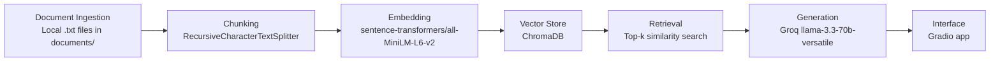

# DMV Weekend Guide — Planning Doc

Use this file to record design decisions as I work through the lab.  
There are no wrong answers — the goal is to explain the reasoning clearly enough that another group could understand and reproduce the system.

---

## Project Domain

My project is an unofficial guide for **weekend activity recommendations for students in the DC, Virginia, and Maryland area**, also known as the DMV area.

The system is designed to help students answer practical weekend-planning questions such as:

- What should I do this weekend?
- Is this activity good for beginners?
- Is this place crowded on weekends?
- Is this a good indoor option during a heat wave?
- Is this activity better for two people, groups, or a short day trip?
- What source supports this recommendation?

This knowledge is hard to find because it is scattered across tourism websites, park pages, local blogs, Reddit threads, restaurant pages, event calendars, and review sites. A student often has to compare many sources just to answer one practical question like “Is Burke Lake beginner-friendly?” or “Is Great Falls too crowded on a Saturday?”

---

## Source Documents

I collected or planned to collect local `.txt` files from DMV-area weekend activity sources. Each file starts with metadata lines such as `Title`, `URL`, `Category`, and `Region`, followed by copied text from the source.

| # | Source | URL / File Path | Purpose |
|---|--------|-----------------|---------|
| 1 | Destination DC: Things to Do This Weekend | `documents/destination_dc_weekend.txt` / https://washington.org/things-to-do-this-weekend-washington-dc | Current DC weekend events, festivals, exhibits, and performances |
| 2 | Destination DC: DC Events Calendar | `documents/destination_dc_events.txt` / https://washington.org/find-dc-listings/dc-events | Broader DC event calendar |
| 3 | DowntownDC Events Calendar | `documents/downtowndc_events.txt` / https://www.downtowndc.org/events/ | Downtown DC public events and free activities |
| 4 | DC250 Events | `documents/dc250_events.txt` / https://dc250.us/events | Special DC celebrations, exhibits, and public events |
| 5 | Fairfax County: Rainy Day Activities | `documents/fxva_rainy_day.txt` / https://www.fxva.com/blog/post/rainy-day-in-fairfax-county/ | Indoor activities for rainy days or heat waves |
| 6 | Fun in Fairfax VA: Indoor Activities in Northern Virginia | `documents/fun_fairfax_indoor.txt` / https://www.funinfairfaxva.com/indoor-activities-in-northern-virginia/ | Local guide to indoor activities in Northern Virginia |
| 7 | Fairfax County: Burke Lake Boating | `documents/burke_lake_boating.txt` / https://www.fairfaxcounty.gov/parks/burke-lake/boating | Official boating and rental information for Burke Lake |
| 8 | Fairfax County: Burke Lake Marina | `documents/burke_lake_marina.txt` / https://www.fairfaxcounty.gov/parks/burke-lake/marina | Rules and marina information for Burke Lake |
| 9 | Fun in Fairfax VA: Burke Lake Boating | `documents/fun_fairfax_burke_lake.txt` / https://www.funinfairfaxva.com/burke-lake-boating/ | Local review-style information about Burke Lake boating |
| 10 | National Park Service: Great Falls Park Basic Information | `documents/great_falls_nps.txt` / https://www.nps.gov/grfa/planyourvisit/basicinfo.htm | Official Great Falls Park information, hours, parking, and safety |
| 11 | Reddit: Great Falls weekend crowd discussion | `documents/reddit_great_falls_crowds.txt` / https://www.reddit.com/r/nova/comments/oidjvc/how_are_the_crowds_at_great_falls_before_9_am_on/ | Community opinions about Great Falls weekend crowds |
| 12 | FXVA: Canoe, Kayak, and Paddleboard Rentals | `documents/fxva_kayak_rentals.txt` / https://www.fxva.com/explore/outdoors/canoe-kayak-paddleboard-rentals/ | Water activity and rental options in Fairfax County |

---

## Architecture

The pipeline has five main RAG stages:

1. **Document Ingestion:** load local `.txt` files from the `documents/` folder and extract metadata.
2. **Chunking:** clean and split documents into readable chunks.
3. **Embedding + Vector Store:** embed chunks with `all-MiniLM-L6-v2` and store them in ChromaDB.
4. **Retrieval:** retrieve the top matching chunks for a user question.
5. **Generation:** pass retrieved chunks to an LLM and generate an answer grounded only in those chunks.

The final interface is a simple Gradio app where the user enters a question and sees both the answer and retrieved sources.

---

## Chunking Strategy

**Chunk size:**  
About **650 characters** per chunk.

**Overlap:**  
About **125 characters** of overlap.

**Why this strategy fits the document text:**  
My documents are a mix of event listings, park information pages, local guides, and community/review-style pages. Most useful facts are short: activity name, location, rental information, crowd warning, price hint, or recommendation. A 650-character chunk is large enough to keep one complete activity or rule together, but small enough that unrelated topics do not get merged.

The overlap helps because important details may be split across nearby sentences. For example, one sentence might describe Burke Lake boat rentals, and the next sentence might explain rules or weekend crowd conditions. Overlap reduces the chance that retrieval returns only half of the useful context.

---

## Milestone 3 Document Pipeline Notes

For Milestone 3, I used local `.txt` files instead of live web scraping. This is simpler and more reliable because many event calendars and review pages include JavaScript, navigation menus, ads, cookie banners, or dynamic content that can be difficult to scrape cleanly.

The pipeline loads all `.txt` files from the `documents/` folder, extracts metadata from the top of each file, cleans the text, and splits each document into chunks using the planned chunk size and overlap.

The script creates:

- `data/raw_docs.json`
- `data/cleaned_docs.json`
- `data/chunks.json`

After chunking, I printed a cleaned document preview and 5 random chunks to confirm that the chunks were readable, substantive, and self-contained.

**Total documents loaded:** ___  
**Total chunks created:** ___

### Chunk Inspection Notes

| Chunk | Source | Good / Bad | Notes |
|------|--------|------------|-------|
| 1 | ___ | ___ | ___ |
| 2 | ___ | ___ | ___ |
| 3 | ___ | ___ | ___ |
| 4 | ___ | ___ | ___ |
| 5 | ___ | ___ | ___ |

---

## Retrieval Approach

The retrieval system embeds the user question using the same embedding model used for document chunks: `sentence-transformers/all-MiniLM-L6-v2`.

The vector store is ChromaDB, stored locally in:

`data/chroma_db`

The collection name is:

`dmv_weekend_guide`

The retriever returns the top **k = 5** chunks by cosine similarity. I chose 5 because many student questions compare multiple options, such as Great Falls vs. Burke Lake or indoor activities for two people. Returning 5 chunks gives the generator enough context without overwhelming it with too many loosely related chunks.

Each chunk stores metadata:

- chunk ID
- source filename
- source title
- source URL
- category
- region
- chunk index

This metadata is important because the final answer needs source attribution.

---

## Retrieval Observations

After implementing retrieval, I tested my vector store with these queries and recorded the top retrieved result, distance score, and whether the result made sense.

| Query | Top result source | Distance score | Does it make sense? |
|-------|-------------------|----------------|---------------------|
| "Is Burke Lake Park good for beginner boating or kayaking?" | ___ | ___ | ___ |
| "What indoor activities are good near Northern Virginia during a heat wave?" | ___ | ___ | ___ |
| "Is Great Falls Park crowded on weekends?" | ___ | ___ | ___ |
| "What are good free things to do in DC this weekend?" | ___ | ___ | ___ |
| "Where can I rent kayaks or paddleboards in Fairfax County?" | ___ | ___ | ___ |

**Anything surprising?**

Retrieval worked best for specific place-based questions, especially when the query included names like Burke Lake, Great Falls, Fairfax County, kayaking, or indoor activities. Broader questions such as “What are good free things to do in DC this weekend?” were harder because they depend on current event listings and clear price labels. If the copied `.txt` documents did not include enough current free event information, the retriever returned more general DC activity chunks instead of a precise answer.

---

## Evaluation Plan

These are the 5 questions I will use to evaluate my system. Each question has a specific expected answer so a grader can check whether the system response is grounded and accurate.

| Test Question | Expected Answer |
|--------------|-----------------|
| Is Burke Lake Park good for beginner boating or kayaking? | The answer should mention that Burke Lake has official boating or rental information and is reasonable for beginner recreation if the source supports it. It should also mention checking rental rules and that weekends may be busier if the retrieved documents include that detail. |
| What indoor activities are good near Northern Virginia during a heat wave? | The answer should recommend indoor Northern Virginia activities from the Fairfax County rainy-day guide or Fun in Fairfax indoor activity guide, such as museums, shopping centers, entertainment venues, cafes, or indoor attractions. |
| Is Great Falls Park crowded on weekends? | The answer should mention weekend crowd or parking concerns using the Great Falls source and/or community crowd discussion. |
| What are good free things to do in DC this weekend? | The answer should use the DC weekend/event sources and identify free or low-cost current DC activities if those documents contain the information. If the documents do not include enough current event details or prices, the system should say it does not have enough information. |
| Where can I rent kayaks or paddleboards in Fairfax County? | The answer should cite the FXVA canoe/kayak/paddleboard rental source or Burke Lake boating source and mention rental locations or available rental types if present in the documents. |

---

## Response Quality

After implementing generation, I tested several questions and checked whether the answers were accurate, grounded in retrieved context, and cited the correct source documents.

| Query | Answer accurate? | Properly grounded? | Cited the right source? |
|-------|------------------|--------------------|--------------------------|
| "Is Burke Lake Park good for beginner boating or kayaking?" | ___ | ___ | ___ |
| "What indoor activities are good near Northern Virginia during a heat wave?" | ___ | ___ | ___ |
| "Is Great Falls Park crowded on weekends?" | ___ | ___ | ___ |
| "What are the best sushi restaurants in New York City?" | ___ | ___ | ___ |

**What would you change about the prompt to improve grounding?**

To improve grounding, I would make the prompt stricter about refusing to answer when the retrieved chunks do not contain enough information. I would also require the model to cite a source number for every major claim, not just list sources at the end. This would make it easier to check whether each part of the answer actually came from the retrieved documents.

I would keep the instruction: “Use only the retrieved context. Do not use outside knowledge.” This is important because the LLM may know general facts about DC, Virginia, or Maryland, but the goal of this project is to answer only from my collected documents.

---

## Milestone 5 Generation and Interface Notes

The generation step connects retrieved chunks to a Groq LLM using:

`llama-3.3-70b-versatile`

The generation prompt instructs the model to:

- answer only from retrieved context
- avoid outside knowledge
- say it does not have enough information if the documents do not answer the question
- cite retrieved sources by source number
- keep answers practical and student-focused
- organize comparisons clearly when the question asks for a comparison

The interface is built with Gradio in `app.py`. A user can type a question, click Ask, and see both the generated answer and the retrieved source list.

I also tested one out-of-domain question to check grounding:

**Question:** What are the best sushi restaurants in New York City?

The expected behavior is that the system should refuse to answer because the documents are about DMV weekend activities, not New York restaurants.

---

## Failure Case Notes

One likely failure case is:

**"What are good free things to do in DC this weekend?"**

This question is difficult because it requires current event information and price details. My local `.txt` source documents may include DC event pages, but if I did not copy enough current listings with explicit free/paid information, retrieval may return general DC event chunks instead of specific free activities.

This failure is tied to the **document ingestion and source coverage stages**, not only the LLM. The generator can only answer from retrieved chunks. If the chunks do not contain enough current free-event details, the system should say it does not have enough information rather than guessing.

Another possible failure case is a comparison question like:

**"For a two-day weekend trip, should I choose Shenandoah or Harpers Ferry?"**

This can fail if my document set does not include strong source documents about both Shenandoah and Harpers Ferry. In that case, retrieval may only return partial context or unrelated hiking chunks. This is a source coverage problem.

---

## AI Tool Usage

I used AI tools to help gathering travel guides that needed from the questions.

### Components I asked AI to help implement

1. **Document ingestion**
   - Load `.txt` files from a `documents/` folder.
   - Extract metadata such as source title, URL, category, and region.
   - Save raw documents to `data/raw_docs.json`.

2. **Text cleaning**
   - Remove HTML tags, HTML entities, cookie text, ads, repeated boilerplate, share buttons, and navigation text.
   - Save cleaned documents to `data/cleaned_docs.json`.

3. **Chunking**
   - Use `RecursiveCharacterTextSplitter`.
   - Use chunk size around 650 characters.
   - Use overlap around 125 characters.
   - Save chunks to `data/chunks.json`.

4. **Embedding and vector store**
   - Use `sentence-transformers/all-MiniLM-L6-v2`.
   - Store embeddings and metadata in ChromaDB.
   - Save the local vector store in `data/chroma_db`.

5. **Retrieval**
   - Implement a retrieval function that accepts a user query and returns the top 5 relevant chunks.
   - Print source title, filename, URL, text, and distance score.

6. **Generation**
   - Use Groq with `llama-3.3-70b-versatile`.
   - Build a prompt that requires answers to come only from retrieved context.
   - Add source attribution.

7. **Interface**
   - Build a Gradio app where users can enter a question and see an answer plus retrieved sources.

---

## Stretch Feature Notes

Possible stretch features:

- Add filters for region: DC, Northern Virginia, Maryland.
- Add filters for activity type: indoor, outdoor, food, hiking, boating, event, day trip.
- Add budget labels such as free, low-cost, moderate, or expensive.
- Add crowd-level labels such as low, medium, or high when sources support them.
- Add comparison mode for questions like “Great Falls or Burke Lake?” and “Shenandoah or Harpers Ferry?”

